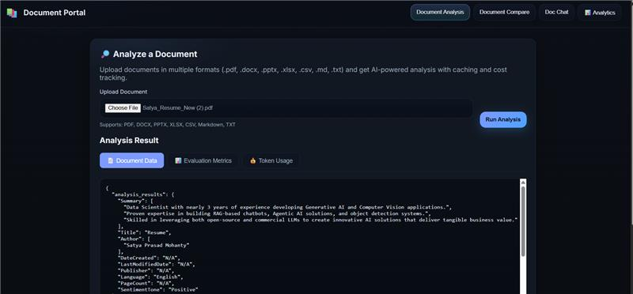
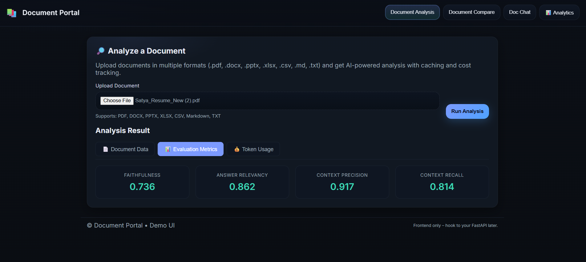
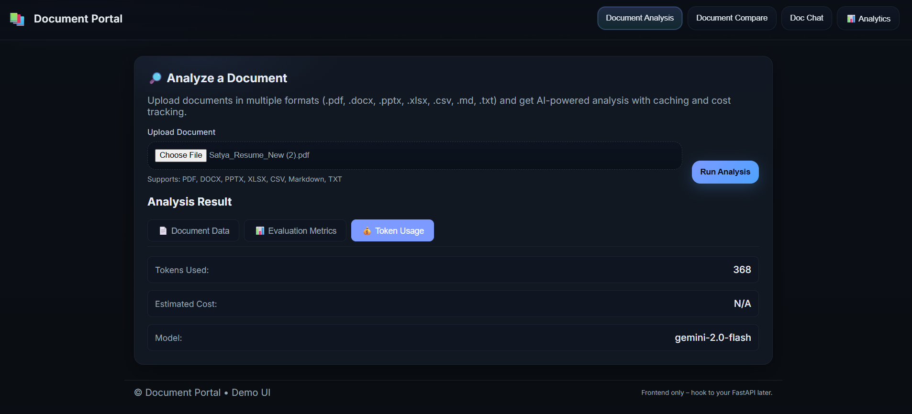

# 🚀 Enhanced Document Portal

A comprehensive, industry-standard document analysis and RAG (Retrieval-Augmented Generation) platform with advanced features including multi-format support, intelligent caching, token tracking, evaluation metrics, and memory management.

[](https://www.python.org/downloads/)
[](https://fastapi.tiangolo.com/)
[](https://opensource.org/licenses/MIT)
[](https://github.com/yourusername/document-portal)

> **🎯 100% FREE Operation** - Uses only free LLM APIs (Groq, Google Gemini) with zero cost token tracking

## 📸 Application Screenshots

### Document Analysis Interface

*Document analysis interface showing comprehensive evaluation metrics*

### Analysis Results with Token Tracking

*Detailed analysis results with evaluation scores and token usage tracking*

### Token Usage Analytics

*Real-time token usage and cost tracking dashboard*

## 🚀 Features

### Core Capabilities
- **Multi-Format Document Support**: PDF, DOCX, TXT, MD, PPT, XLSX, CSV, SQLite, MongoDB
- **Advanced Document Processing**: Table extraction, image OCR, metadata analysis
- **Conversational RAG**: Context-aware chat with document collections
- **Document Comparison**: Semantic comparison between documents
- **Real-time Analysis**: Comprehensive document analysis and summarization

### Industry-Ready Enhancements
- **🔄 Multi-Tier Caching**: Redis, disk, and in-memory caching for optimal performance
- **📊 Evaluation Framework**: DeepEval integration with faithfulness, relevancy, and bias metrics
- **💰 Cost Analysis**: Token counting and API cost monitoring across all operations
- **🧠 Memory Management**: Persistent chat history and session management
- **🔒 Data Validation**: Comprehensive Pydantic models for type safety
- **🧪 Testing Suite**: 15+ test cases for pre/post-commit validation

## 📋 Quick Start

### Environment Setup

```bash
# Clone the repository
git clone https://github.com/sunnysavita10/document_portal.git
cd document_portal

# Create conda environment
conda create -p venv python=3.10 -y
conda activate ./venv

# Install dependencies
pip install -r requirements.txt

# Set up environment variables
cp .env.example .env
# Edit .env with your API keys
```

### Required API Keys

Create a `.env` file with the following:

```env
# Free LLM API Keys (choose one or both)
GROQ_API_KEY=your_groq_key_here
GOOGLE_API_KEY=your_gemini_key_here

# Optional: Redis for caching
REDIS_URL=redis://localhost:6379

# Optional: Database connections
DATABASE_URL=your_database_url_here
MONGODB_URL=your_mongodb_url_here
```

### API Key Sources
- **Groq**: [Get API Key](https://console.groq.com/keys) (Free)
- **Gemini**: [Get API Key](https://aistudio.google.com/apikey) (Free tier available)

### Running the Application

```bash
# Start the FastAPI server
uvicorn api.main:app --host 0.0.0.0 --port 8080 --reload

# Access the application
# Web UI: http://localhost:8080
# API Docs: http://localhost:8080/docs
```

## 📚 Supported Document Formats

| Format | Extension | Features |
|--------|-----------|----------|
| PDF | `.pdf` | ✅ Text, Tables, Images, OCR |
| Word | `.docx` | ✅ Text, Tables, Formatting |
| Text | `.txt` | ✅ Plain text processing |
| Markdown | `.md` | ✅ Structured text, HTML conversion |
| PowerPoint | `.ppt`, `.pptx` | ✅ Slides, Text, Tables |
| Excel | `.xlsx`, `.xls` | ✅ Sheets, Data analysis |
| CSV | `.csv` | ✅ Data processing, Statistics |
| SQLite | `.db`, `.sqlite` | ✅ Schema, Sample data |
| MongoDB | Connection | ✅ Document collections |

## 🔧 API Endpoints

### Core Endpoints
- `POST /analyze` - Document analysis
- `POST /compare` - Document comparison
- `POST /chat/index` - Build search index
- `POST /chat/query` - Query documents

### Enhanced Endpoints
- `POST /analyze/enhanced` - Advanced analysis with caching
- `POST /chat/query/enhanced` - Chat with memory and evaluation
- `GET /health/detailed` - System health with metrics
- `GET /sessions/{id}/history` - Conversation history
- `GET /analytics/token-usage` - Cost analysis
- `GET /analytics/cache-stats` - Cache performance
- `POST /evaluation/batch` - Batch evaluation
- `DELETE /cache/clear` - Cache management

## 🧪 Testing

```bash
# Run all tests
pytest

# Run with coverage
pytest --cov=. --cov-report=html

# Run specific test categories
pytest tests/test_enhanced_features.py -v
pytest tests/test_api_integration.py -v
```

### Pre-commit Hooks

```bash
# Install pre-commit
pip install pre-commit

# Set up hooks
pre-commit install

# Run manually
pre-commit run --all-files
```

## 📊 Monitoring & Analytics

### Token Usage Tracking
Monitor API costs across all operations:
```python
from utils.token_counter import get_token_counter

counter = get_token_counter()
stats = counter.get_cost_breakdown(days=30)
print(f"Total cost: ${stats['total_cost']:.4f}")
```

### Cache Performance
```python
from utils.caching import get_cache_manager

cache = get_cache_manager()
stats = cache.get_stats()
print(f"Cache hit rate: {stats.get('cache_hit_rate', 0):.2%}")
```

### Evaluation Metrics
```python
from utils.evaluation import evaluate_response

metrics = evaluate_response(
    question="What is AI?",
    answer="AI is artificial intelligence...",
    context=["AI context documents..."]
)
print(f"Faithfulness: {metrics.faithfulness:.3f}")
```

## 🏗️ Architecture

```
document_portal/
├── api/                    # FastAPI application
├── src/                    # Core business logic
│   ├── document_analyzer/  # Document analysis
│   ├── document_chat/      # RAG implementation
│   ├── document_compare/   # Document comparison
│   └── document_ingestion/ # Document processing
├── utils/                  # Enhanced utilities
│   ├── enhanced_document_loaders.py
│   ├── caching.py         # Multi-tier caching
│   ├── token_counter.py   # Cost analysis
│   ├── evaluation.py      # DeepEval integration
│   └── memory_manager.py  # Session management
├── model/                  # Pydantic models
├── tests/                  # Comprehensive test suite
└── requirements.txt        # Dependencies
```

## 🔧 Configuration

### Caching Configuration
```python
# Redis (recommended for production)
REDIS_URL=redis://localhost:6379

# Disk cache fallback
CACHE_DIR=./cache

# Memory cache size
MEMORY_CACHE_SIZE=1000
```

### Model Configuration
```python
# Default models (Free APIs)
LLM_MODEL=llama3-8b-8192  # Groq
EMBEDDING_MODEL=text-embedding-004  # Google

# Evaluation model
EVALUATION_MODEL=gemini-2.0-flash  # Google Gemini
```

## 📈 Performance Optimization

### Caching Strategy
- **Memory Cache**: Frequently accessed data (1-hour TTL)
- **Redis Cache**: Session data and responses (24-hour TTL)
- **Disk Cache**: Document analysis results (7-day TTL)

### Token Optimization
- Automatic prompt truncation for large documents
- Response caching to avoid duplicate API calls
- Batch processing for multiple documents

## 🚀 Deployment

### Docker Deployment
```bash
# Build image
docker build -t document-portal .

# Run container
docker run -p 8080:8080 -e GROQ_API_KEY=your_groq_key -e GOOGLE_API_KEY=your_gemini_key document-portal
```

### Production Considerations
- Set up Redis for caching
- Configure proper logging levels
- Enable HTTPS
- Set up monitoring and alerting
- Regular cache cleanup and session management

## 🤝 Contributing

1. Fork the repository
2. Create a feature branch
3. Run tests: `pytest`
4. Submit a pull request

## 📄 License

This project is licensed under the MIT License - see the LICENSE file for details.
